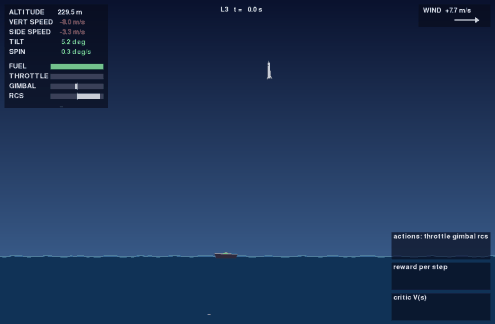

# RocketLandingWithRL

A 2D rocket learns to land on a moving, rocking drone ship in gusty wind. The physics, the
environment and every reinforcement learning algorithm are written from scratch in Python, trained
on a laptop CPU, and compared against a hand-written PID controller.


Status: **Phase 5 done**: environment, viewer, baselines, and six learning agents (REINFORCE, PPO,
SAC, TD3, GRPO, evolution strategies) trained on a laptop CPU. Curriculum, domain randomization and a
full evaluation suite come next.

## Results so far

Success rate on 100 held-out start states per level (seeds 10000–10099, never used in training):

| Agent | L0 | L1 | L2 | L3 | L4 |
|---|---|---|---|---|---|
| Random | 0% | 0% | 0% | 0% | 0% |
| PID (hand-written) | 100% | 100% | 98% | 45% | 45% |
| PPO, trained on L0 | 97% | 52% | 0% | 0% | 0% |
| PPO, trained on L1 | 42% | 97% | 0% | 0% | 0% |
| PPO, trained on L2 | 46% | 85% | 94% | 55% | 10% |
| **PPO, trained on L3** | **100%** | **99%** | **99%** | **95%** | 10% |
| PPO, trained on L4 | 0% | 0% | 4% | 12% | 46% |
| REINFORCE, trained on L0 | 100% | 87% | 0% | 0% | 0% |
| REINFORCE, trained on L1 | 90% | 50% | 0% | 0% | 0% |
| REINFORCE, trained on L2 | 0% | 0% | 18% | 8% | 1% |
| REINFORCE, trained on L3 | 0% | 0% | 0% | 0% | 1% |
| REINFORCE, trained on L4 | 0% | 0% | 0% | 2% | 1% |
| SAC, trained on L0 | 98% | 61% | 0% | 0% | 0% |
| SAC, trained on L1 | 99% | 87% | 0% | 0% | 0% |
| SAC, trained on L2 | 75% | 46% | 33% | 23% | 1% |
| SAC, trained on L3 | 0% | 0% | 0% | 0% | 0% |
| SAC, trained on L4 | 0% | 0% | 0% | 0% | 0% |
| TD3, trained on L0 | 92% | 87% | 4% | 2% | 0% |
| TD3, trained on L1 | 61% | 60% | 0% | 0% | 0% |
| TD3, trained on L2 | 13% | 40% | 52% | 37% | 12% |
| TD3, trained on L3 | 53% | 22% | 5% | 1% | 2% |
| TD3, trained on L4 | 0% | 0% | 0% | 0% | 0% |
| GRPO, trained on L0 | 100% | 63% | 0% | 0% | 0% |
| GRPO, trained on L1 | 100% | 89% | 0% | 0% | 0% |
| GRPO, trained on L2 | 100% | 82% | 86% | 33% | 9% |
| GRPO, trained on L3 | 0% | 1% | 1% | 14% | 4% |
| GRPO, trained on L4 | 0% | 0% | 0% | 0% | 1% |
| ES, trained on L0 | 97% | 60% | 0% | 0% | 0% |
| ES, trained on L1 | 100% | 100% | 0% | 0% | 0% |
| **ES, trained on L2** | **100%** | **96%** | **90%** | 60% | 11% |
| ES, trained on L3 | 39% | 81% | 63% | 64% | 27% |
| ES, trained on L4 | 0% | 0% | 0% | 0% | 0% |

Each agent is one seed. PPO, REINFORCE and GRPO learn from scratch for 5 M steps (6–8 minutes).
Evolution strategies (ES) learn from scratch for 20 M steps (about 17 minutes; its simulation is
batched, so steps are cheap). SAC and TD3 train for 1 M steps (15–21 minutes) and start from 50 k
steps of noisy PID demonstrations in their replay buffer (see below). The checkpoints are in
`checkpoints/`. What the table shows:

- **Randomization makes generalists.** The agent trained on L3, where wind, mass, thrust and engine
  lag change every episode, lands 95–100% on L0–L3: better than each level's own specialist, and
  more than twice the PID in wind. Agents trained on one fixed setting overfit to it.
- **L4 (far, fast booster return) is still hard.** The best learned agent matches the PID at about
  45%. Fine-tuning the L2 agent on L3 and L4 did worse than training from scratch (55% and 4%), because
  its exploration noise had already collapsed.
- **PPO beats REINFORCE everywhere beyond L0**, on the same network, normalization and step budget.
- **GRPO needs no critic.** It restarts 8 rollouts from the same simulator snapshot and scores each
  against its siblings, the way LLM post-training scores several answers to one prompt. It comes
  close to PPO on L0–L2 (100%, 89%, 86% against PPO's 97%, 97%, 94%). One score per 600-step
  rollout is coarse credit, though, and it falls apart in wind (L3: 14%). Optionally
  (`pretrain: bc_pid`), GRPO first behavior-clones the PID, like supervised fine-tuning before RL.
  With a low sampling noise (`init_log_std: -2`) that reached 92% on L2 in 400 k steps.
- **Gradient-free evolution strategies are the surprise.** A 1.5k-parameter policy searched by
  perturbing its weights (no gradients through the episode, no value function) lands 90–100% on
  L0–L2. The L2 agent also transfers well: 96% on L1 and 60% on the unseen, windy L3. It used a 4×
  larger step budget than PPO, but its batched simulation makes steps cheap.
- **Off-policy agents need help to explore here.** From scratch, SAC and TD3 never landed once in
  1 M steps: random warm-up actions only produce hard crashes, and both settle into hovering until
  the fuel runs out. Seeding the replay buffer with noisy PID flights (data an off-policy learner can
  replay directly) makes L0 work: SAC lands on all 20 evaluation starts by about 500 k environment
  steps, against about 1 M for PPO. It runs at about 1/18 of PPO's steps per second, though, so it
  is slower in wall-clock time. From L1 on (TD3 60%, SAC 87%) they trail PPO, and wind (L3) defeats
  them. That is where on-policy PPO's steady exploration wins. SAC and TD3 use γ = 0.99: the
  demonstrations supply the long-range signal, and 0.995 scored worse in prototyping.



## Train your own

```bash
uv run rl-train --algo ppo --level L2 --seed 1          # ~6 min on a laptop CPU
uv run rl-train --algo sac --level L0 --seed 1          # SAC / TD3 warm up on PID demonstrations
uv run rl-train --algo grpo --level L1 --seed 1         # critic-free, group-relative
uv run rl-train --algo es --level L2 --seed 1           # gradient-free, ~17 min
uv run rl-eval --agent runs/ppo_L2_s1/model.pt --level L2
uv run rl-watch --agent runs/ppo_L2_s1/model.pt --level L2
tensorboard --logdir runs                               # learning curves
```

Hyperparameters live in `src/rocketlander/configs/algos/<algo>.yaml`. `rl-train`
logs to TensorBoard and `runs/<name>/metrics.csv`, evaluates on held-out seeds during training,
and saves a checkpoint with its config and git commit.

## Quickstart

```bash
git clone https://github.com/dhairya-pandya/RocketLandingWithRL.git
cd RocketLandingWithRL
uv sync
uv run pytest
```

```python
from rocketlander.agents.pid import PIDAgent
from rocketlander.envs.rocket_env import RocketLanderEnv

env = RocketLanderEnv(level="L2")
agent = PIDAgent()
obs, _ = env.reset(seed=0)
done = False
while not done:
    obs, reward, terminated, truncated, info = env.step(agent.act(obs))
    done = terminated or truncated
print(info["outcome"], info["reason"])
```

## Watch it, fly it, record it

```bash
uv run rl-watch --agent pid --level L2      # pid, random, or a checkpoint such as checkpoints/ppo_L2.pt
uv run rl-play --level L0                   # fly it yourself
uv run rl-record --agent pid --level L2 --seed 3 --out videos/landing.gif
```

| Keys | `rl-play` | `rl-watch` |
|---|---|---|
| W / S | throttle up / down (sticky) | |
| A / D | lean left / right (engine gimbal) | |
| Q / E | lean left / right (side thrusters, RCS) | |
| R / N | restart / new start position | N: next episode |
| Space | | pause |
| F V T P H | toggle force arrows, velocity, trail, plots, HUD | same |
| Esc | quit | quit |

The HUD turns each landing limit green once it is met (vertical and sideways speed, tilt, spin).
The mini-plots show the agent's actions, its reward per step and, for agents with a critic, its
value estimate V(s). Any script can also render through Gymnasium:
`RocketLanderEnv(level="L2", render_mode="human")` or `render_mode="rgb_array"`.

## The environment

**Physics.** The rocket is a 2D rigid body (`x, y, vx, vy, θ, ω`, fuel) integrated with
semi-implicit Euler at 60 Hz. The main engine's thrust is tilted by a ±15° gimbal; because it pushes
at the base, tilting the nozzle spins the rocket (`τ = −T·sin δ·L/2`). Side thrusters (RCS) add
rotation control. Quadratic drag uses air-relative velocity, which is how wind pushes the rocket.
Burning fuel makes the rocket lighter.

**The drone ship** sways, drifts, heaves and rolls, all as closed-form functions of time.
**Wind** is an Ornstein–Uhlenbeck process: a mean speed plus gusts that decay back to it.

**Touchdown.** The episode ends when a leg touches the deck or the sea. It is a landing only if
both legs are on the deck and, relative to the deck, the vertical speed is ≤ 2 m/s, the sideways
speed ≤ 1.5 m/s, the tilt ≤ 10° and the spin ≤ 0.3 rad/s. Otherwise the episode reports the reason
it crashed.

| | |
|---|---|
| Action | `Box(-1, 1, (3,))`: throttle, gimbal, RCS, at 30 Hz |
| Observation | 11 floats: position and velocity relative to the deck, `sin θ`, `cos θ`, `ω`, deck roll and roll rate, fuel remaining (tonnes), actual throttle. Wind is **not** observed. |
| Reward | Progress shaping `Φ(s') − Φ(s)` (closer, slower, more upright is better; `Φ` is kept at touchdown), fuel and time costs, +100 plus a softness bonus for landing, a deck crash graded by impact speed (−20 − 8·v, down to −100), and −100 for missing the ship, leaving the flight box or running out of fuel. `reward_mode="sparse"` keeps only the terminal reward. |
| Task reward | `info["task_reward"]` is the unshaped reward (terminal reward minus fuel and time costs). Evaluations and comparisons use it. |
| Snapshots | `get_state()` / `set_state()` / `reset(options={"state": s})` restore the env exactly, including the random number generator. |
| Checkpoints | `torch.load(..., weights_only=True)`: loading a checkpoint never runs pickled code. Training seeds are refused if they would reach the evaluation seeds. |

## Levels

| Level | What changes | Fuel | Time limit |
|---|---|---|---|
| L0 | Static pad, no wind, start close above | 1.0–1.2 t | 40 s |
| L1 | Ship sways and drifts | 1.3–1.5 t | 60 s |
| L2 | Ship also rolls and heaves | 1.5–1.7 t | 60 s |
| L3 | Wind gusts, randomized mass, thrust and engine lag | 1.5–1.7 t | 60 s |
| L4 | Booster return: far start at high speed | 2.8–3.2 t | 100 s |

Levels are YAML files in `src/rocketlander/configs/levels/` (angles in degrees, `_deg` keys);
add a file to add a level. The PID controller is tuned for nominal physics, so L3's randomized
rocket and wind are where it struggles: that gap is what the learning agents have to close.

## Why the reward looks the way it does

The first PPO runs did not land; they learned to **hover** until the time limit. Three changes fixed
it, each a textbook lesson:

1. **Discount.** With γ = 0.99 the agent looks about 3 s ahead, but landings are 10–30 s away.
   PPO uses γ = 0.999.
2. **Shaping that grades the touchdown.** Classic potential-based shaping (`Φ(terminal) = 0`)
   provably keeps the optimal policy, but it scores a crash at 3 m/s the same as one at 30 m/s, and
   with γ < 1 it pays a small bonus for every step spent alive. Keeping `Φ` at touchdown and grading
   deck crashes by impact speed gives the learner a slope toward "slower is better".
3. **Limited fuel.** With a 5 t tank the rocket could hover past the time limit, and a time-limit
   ending carries no penalty. Every level's tank now runs dry before its time limit, so hovering
   ends in an observable "out of fuel" failure. Closing this on L1–L2 as well raised PPO from
   89% to 97% on L1 and from 85% to 94% on L2.

## Development

```bash
uv run pytest                 # fast tests
uv run pytest -m slow         # learning tests (later phases)
uv run ruff check . && uv run ruff format --check .
```

## License

MIT
