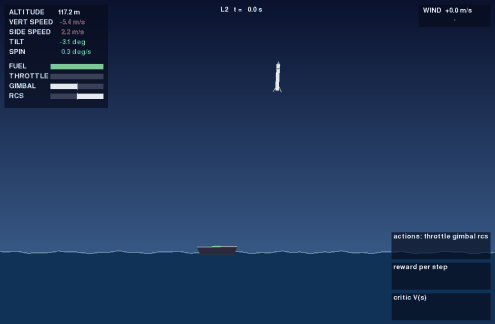

# RocketLandingWithRL

A 2D rocket learns to land on a moving, rocking drone ship in gusty wind. The physics, the
environment and every reinforcement learning algorithm are written from scratch in Python, trained
on a laptop CPU, and compared against a hand-written PID controller.



Status: **Phase 2 done**: environment, physics, baselines and the graphical viewer. Learning agents
(REINFORCE, PPO, SAC, TD3, GRPO, CEM/ES) and results come in the next phases.

## Quickstart

```bash
git clone https://github.com/dhairya-pandya/RocketLandingWithRL.git
cd RocketLandingWithRL
uv sync
uv run pytest
```

```python
from rocketlander.agents.pid import PIDAgent
from rocketlander.envs.rocket_env import RocketLanderEnv

env = RocketLanderEnv(level="L2")
agent = PIDAgent()
obs, _ = env.reset(seed=0)
done = False
while not done:
    obs, reward, terminated, truncated, info = env.step(agent.act(obs))
    done = terminated or truncated
print(info["outcome"], info["reason"])
```

## Watch it, fly it, record it

```bash
uv run rl-watch --agent pid --level L2      # watch an agent (pid or random for now)
uv run rl-play --level L0                   # fly it yourself
uv run rl-record --agent pid --level L2 --seed 3 --out videos/landing.gif
```

| Keys | `rl-play` | `rl-watch` |
|---|---|---|
| W / S | throttle up / down (sticky) | |
| A / D | swing the nozzle (gimbal) | |
| Q / E | side thrusters (RCS) | |
| R / N | restart / new start position | N: next episode |
| Space | | pause |
| F V T P H | toggle force arrows, velocity, trail, plots, HUD | same |
| Esc | quit | quit |

The HUD turns each landing limit green once it is met (vertical and sideways speed, tilt, spin).
The mini-plots show the agent's actions, its reward per step and, for agents with a critic, its
value estimate V(s). Any script can also render through Gymnasium:
`RocketLanderEnv(level="L2", render_mode="human")` or `render_mode="rgb_array"`.

## The environment

**Physics.** The rocket is a 2D rigid body (`x, y, vx, vy, θ, ω`, fuel) integrated with
semi-implicit Euler at 60 Hz. The main engine's thrust is tilted by a ±15° gimbal; because it pushes
at the base, tilting the nozzle spins the rocket (`τ = −T·sin δ·L/2`). Side thrusters (RCS) add
rotation control. Quadratic drag uses air-relative velocity, which is how wind pushes the rocket.
Burning fuel makes the rocket lighter.

**The drone ship** sways, drifts, heaves and rolls, all as closed-form functions of time.
**Wind** is an Ornstein–Uhlenbeck process: a mean speed plus gusts that decay back to it.

**Touchdown.** The episode ends when a leg touches the deck or the sea. It is a landing only if
both legs are on the deck and, relative to the deck, the vertical speed is ≤ 2 m/s, the sideways
speed ≤ 1.5 m/s, the tilt ≤ 10° and the spin ≤ 0.3 rad/s. Otherwise the episode reports the reason
it crashed.

| | |
|---|---|
| Action | `Box(-1, 1, (3,))`: throttle, gimbal, RCS, at 30 Hz |
| Observation | 11 floats: position and velocity relative to the deck, `sin θ`, `cos θ`, `ω`, deck roll and roll rate, fuel fraction, actual throttle. Wind is **not** observed. |
| Reward | Potential-based shaping `γΦ(s') − Φ(s)` (closer, slower, more upright is better), small fuel cost, +100 plus a softness bonus for landing, −100 for a crash. `reward_mode="sparse"` keeps only the terminal reward. |
| Task reward | `info["task_reward"]` is the unshaped reward (terminal reward minus fuel cost). Compare agents with it: shaping only preserves the optimal policy for a learner that discounts with `shaping_gamma` (default 0.99), so pass `shaping_gamma=1.0` for methods that optimize raw episode returns. |
| Snapshots | `get_state()` / `set_state()` / `reset(options={"state": s})` restore the env exactly, including the random number generator. |

## Levels and baselines

| Level | What changes | PID success (100 seeds) |
|---|---|---|
| L0 | Static pad, no wind, start close above | 100% |
| L1 | Ship sways and drifts | 100% |
| L2 | Ship also rolls and heaves | 97% |
| L3 | Wind gusts, randomized mass, thrust and engine lag | 47% |
| L4 | Booster return: far start at high speed | 40% |

Levels are YAML files in `src/rocketlander/configs/levels/` (angles in degrees, `_deg` keys);
add a file to add a level. A random policy never lands.

The PID controller is tuned for nominal physics. On L3 the randomized mass, thrust and engine lag
cost it the most (47% becomes 70% with nominal physics), and wind costs the rest (94% with
neither). L4 behaves the same way. That gap is what the learning agents have to close.

## Development

```bash
uv run pytest                 # fast tests
uv run pytest -m slow         # learning tests (later phases)
uv run ruff check . && uv run ruff format --check .
```

## License

MIT
