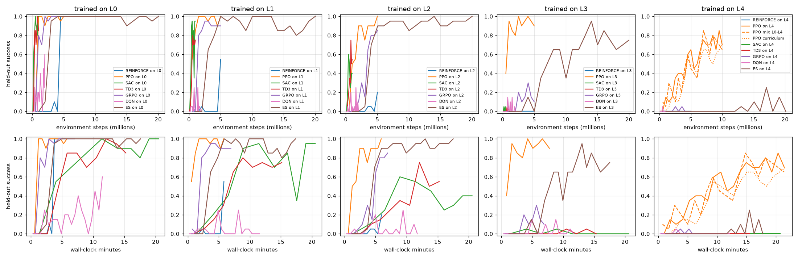
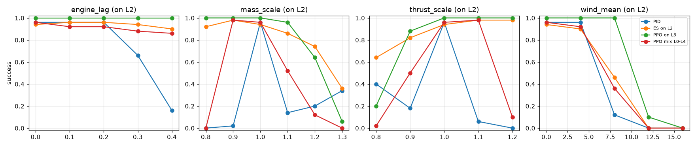
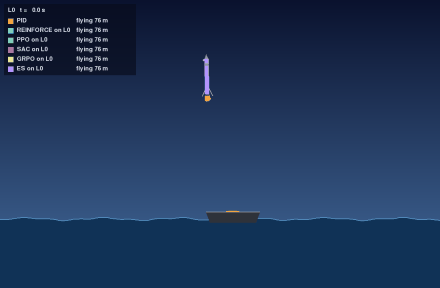
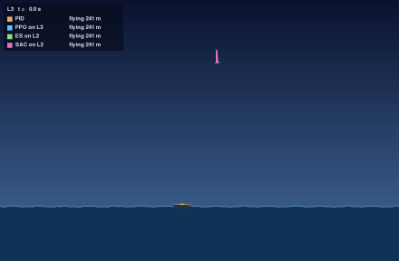
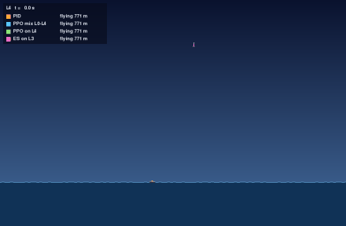

# Results

Generated by `uv run rl-compare --report results.yaml`; edit that file to change what is compared. Success rates are over held-out start states (seeds 10000 and up, never used in training), with 95% Wilson intervals.

## Success rate by level

| Agent | L0 | L1 | L2 | L3 | L4 |
|---|---|---|---|---|---|
| Random | 0% (0–4) | 0% (0–4) | 0% (0–4) | 0% (0–4) | 0% (0–4) |
| PID | **100% (96–100)** | **100% (96–100)** | 98% (93–99) | 45% (36–55) | 45% (36–55) |
| MPC planner | 77% (68–84) | 63% (53–72) | 48% (38–58) | 27% (19–36) | 14% (9–22) |
| REINFORCE on L0 | **100% (96–100)** | 87% (79–92) | 0% (0–4) | 0% (0–4) | 0% (0–4) |
| REINFORCE on L1 | 90% (83–94) | 50% (40–60) | 0% (0–4) | 0% (0–4) | 0% (0–4) |
| REINFORCE on L2 | 0% (0–4) | 0% (0–4) | 18% (12–27) | 8% (4–15) | 1% (0–5) |
| REINFORCE on L3 | 0% (0–4) | 0% (0–4) | 0% (0–4) | 0% (0–4) | 1% (0–5) |
| REINFORCE on L4 | 0% (0–4) | 0% (0–4) | 0% (0–4) | 2% (1–7) | 1% (0–5) |
| PPO on L0 | 97% (92–99) | 52% (42–62) | 0% (0–4) | 0% (0–4) | 0% (0–4) |
| PPO on L1 | 42% (33–52) | 97% (92–99) | 0% (0–4) | 0% (0–4) | 0% (0–4) |
| PPO on L2 | 46% (37–56) | 85% (77–91) | 94% (88–97) | 55% (45–64) | 10% (6–17) |
| PPO on L3 | **100% (96–100)** | 99% (95–100) | 99% (95–100) | **95% (89–98)** | 10% (6–17) |
| PPO on L4 | 0% (0–4) | 0% (0–4) | 0% (0–4) | 8% (4–15) | 57% (47–66) |
| PPO mix L0-L4 | **100% (96–100)** | **100% (96–100)** | 96% (90–98) | 60% (50–69) | 53% (43–62) |
| PPO curriculum | **100% (96–100)** | **100% (96–100)** | **100% (96–100)** | 70% (60–78) | **65% (55–74)** |
| SAC on L0 | 98% (93–99) | 61% (51–70) | 0% (0–4) | 0% (0–4) | 0% (0–4) |
| SAC on L1 | 99% (95–100) | 87% (79–92) | 0% (0–4) | 0% (0–4) | 0% (0–4) |
| SAC on L2 | 75% (66–82) | 46% (37–56) | 33% (25–43) | 23% (16–32) | 1% (0–5) |
| SAC on L3 | 0% (0–4) | 0% (0–4) | 0% (0–4) | 0% (0–4) | 0% (0–4) |
| SAC on L4 | 0% (0–4) | 0% (0–4) | 0% (0–4) | 0% (0–4) | 0% (0–4) |
| TD3 on L0 | 92% (85–96) | 87% (79–92) | 4% (2–10) | 2% (1–7) | 0% (0–4) |
| TD3 on L1 | 61% (51–70) | 60% (50–69) | 0% (0–4) | 0% (0–4) | 0% (0–4) |
| TD3 on L2 | 13% (8–21) | 40% (31–50) | 52% (42–62) | 37% (28–47) | 12% (7–20) |
| TD3 on L3 | 53% (43–62) | 22% (15–31) | 5% (2–11) | 1% (0–5) | 2% (1–7) |
| TD3 on L4 | 0% (0–4) | 0% (0–4) | 0% (0–4) | 0% (0–4) | 0% (0–4) |
| GRPO on L0 | **100% (96–100)** | 63% (53–72) | 0% (0–4) | 0% (0–4) | 0% (0–4) |
| GRPO on L1 | **100% (96–100)** | 89% (81–94) | 0% (0–4) | 0% (0–4) | 0% (0–4) |
| GRPO on L2 | **100% (96–100)** | 82% (73–88) | 86% (78–91) | 33% (25–43) | 9% (5–16) |
| GRPO on L3 | 0% (0–4) | 1% (0–5) | 1% (0–5) | 14% (9–22) | 4% (2–10) |
| GRPO on L4 | 0% (0–4) | 0% (0–4) | 0% (0–4) | 0% (0–4) | 1% (0–5) |
| DQN on L0 | 47% (38–57) | 8% (4–15) | 0% (0–4) | 0% (0–4) | 0% (0–4) |
| DQN on L1 | 0% (0–4) | 0% (0–4) | 0% (0–4) | 0% (0–4) | 0% (0–4) |
| DQN on L2 | 0% (0–4) | 0% (0–4) | 0% (0–4) | 0% (0–4) | 0% (0–4) |
| DQN on L3 | 0% (0–4) | 1% (0–5) | 1% (0–5) | 0% (0–4) | 0% (0–4) |
| DQN on L4 | 0% (0–4) | 0% (0–4) | 0% (0–4) | 1% (0–5) | 1% (0–5) |
| ES on L0 | 97% (92–99) | 60% (50–69) | 0% (0–4) | 0% (0–4) | 0% (0–4) |
| ES on L1 | **100% (96–100)** | **100% (96–100)** | 0% (0–4) | 0% (0–4) | 0% (0–4) |
| ES on L2 | **100% (96–100)** | 96% (90–98) | 90% (83–94) | 60% (50–69) | 11% (6–19) |
| ES on L3 | 39% (30–49) | 81% (72–87) | 63% (53–72) | 64% (54–73) | 27% (19–36) |
| ES on L4 | 0% (0–4) | 0% (0–4) | 0% (0–4) | 0% (0–4) | 0% (0–4) |

Bold: best on that level (ties included).

## Learning curves

Held-out success during training (20 episodes per point), against environment steps (sample efficiency) and against wall-clock time on one CPU core. Runs trained several at a time, so the times are approximate.

## Robustness

One physical parameter pinned per point, the rest sampled as on L2; 50 episodes per point.

## Races

Every agent flies the same start state, ship motion and wind.

## Lessons learned

This section is kept when the report is rebuilt; edit it freely.

1. **The reward decides what is learned.** The first PPO agents hovered until the time limit,
   because that scored better than risking a crash. A time cost, limited fuel and a crash penalty
   graded by impact speed closed the loophole, not a better algorithm.
2. **The horizon must match the task.** With γ = 0.99 the agent looks about 3 s ahead, but a landing
   takes 10–30 s. PPO needed γ = 0.999.
3. **Randomization builds generalists; narrow training builds specialists.** PPO trained on L3,
   where physics and wind change every episode, lands 95–100% on L0–L3. Trained on L4 alone it
   forgets how to land from a gentle start.
4. **Off-policy learners need to see success before they can learn it.** SAC and TD3 never landed
   from scratch; seeding their replay buffer with PID flights fixed it.
5. **Simple methods go surprisingly far on small problems.** Gradient-free evolution strategies
   and critic-free GRPO come close to PPO on L0–L2, but one score per long, noisy episode is too coarse for
   wind (GRPO: 14% on L3).
6. **One seed is an anecdote.** Five curriculum runs with identical code landed 9–74% on L4.
   Intervals and several seeds are part of the result, not decoration.
7. **The worst bugs do not crash.** Storing NumPy views instead of copies silently paired GRPO's
   actions with the wrong observations, and it still ran.
8. **A controller is only as good as its model.** The PID assumes nominal physics; a rocket 10%
   lighter than expected hovers until its fuel runs out.
